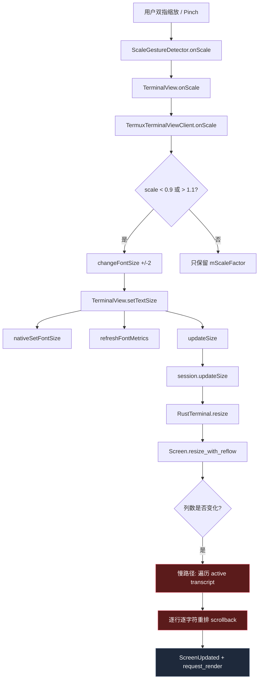
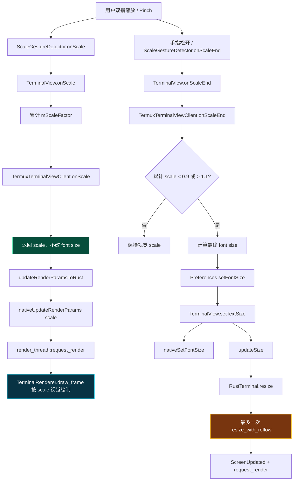
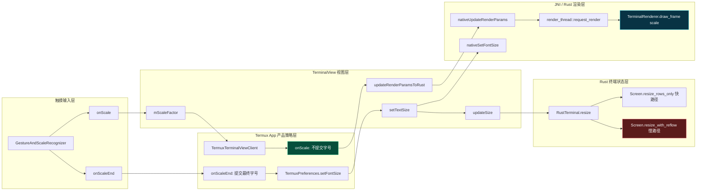
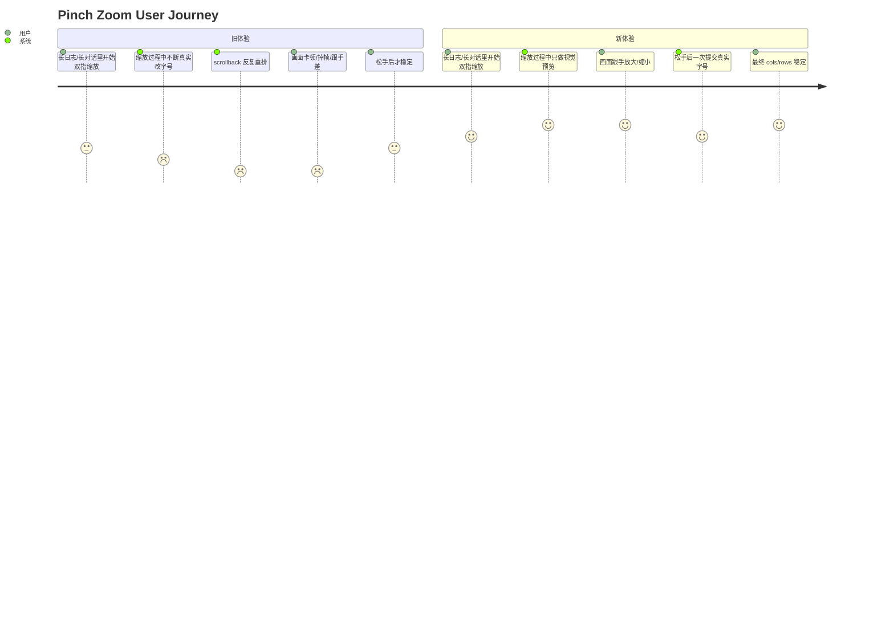
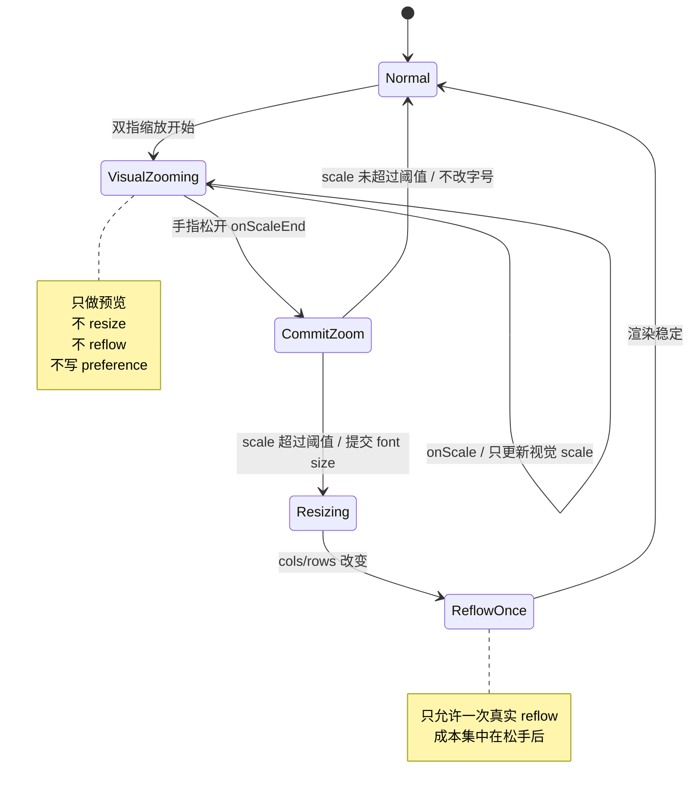

# Pinch Zoom / Long Scrollback Reflow Optimization Maps

Commit: `f34e3bc2 Defer terminal reflow during pinch zoom`

## 1. 技术图：缩放事件如何从“连续重排”变成“视觉缩放 + 一次提交”

### Before：旧路径，缩放过程中反复触发真实 resize/reflow



问题点：

- `onScale` 是高频事件，一次手势里会触发很多次。
- 每次超过阈值就真实改变 font size。
- 真实 font size 改变后会重新计算 cols/rows。
- cols 变化会进入 `resize_with_reflow()` 慢路径。
- 长 scrollback 下复杂度接近：

```text
O(active_transcript_rows × old_columns)
```

也就是说，长日志/长对话越多，缩放时越容易卡。

---

### After：新路径，缩放中只视觉缩放，松手后一次真实提交



新路径的关键变化：

- 缩放过程中：只更新 `mScaleFactor`，走 Rust 视觉缩放。
- 不调用 `changeFontSize()`。
- 不调用 `setTextSize()`。
- 不触发 `updateSize()`。
- 不触发 `resize_with_reflow()`。
- 手势结束后：如果累计 scale 达到阈值，才提交一次真实字号变化。

---

## 2. 技术分层图：哪些层负责什么



职责边界：

| 层 | 职责 | 本次变化 |
|---|---|---|
| GestureAndScaleRecognizer | 识别缩放手势 | 新增 `onScaleEnd` |
| TerminalView | 保存临时视觉 scale，通知 Rust 绘制 | 缩放中只传 scale，不提交字号 |
| TermuxTerminalViewClient | 决定什么时候真正改变字号 | 从 `onScale` 移到 `onScaleEnd` |
| Rust render_thread | 按 scale 绘制当前帧 | 继续使用已有 `nativeUpdateRenderParams` |
| Rust terminal state | resize/reflow 终端状态 | 从高频触发变成最多一次触发 |

---

## 3. 产品图：用户体验从“边捏边卡”变成“边捏边预览，松手确认”

### 用户视角流程



---

### 产品状态机



---

## 4. 验收标准

### 日志验收

安装后执行：

```bash
logcat | grep -E "Pinch zoom commit|nativeSetFontSize|RustTerminal.resize|resize_with_reflow"
```

预期：

1. 双指缩放过程中，不应该连续刷 `nativeSetFontSize`。
2. 双指缩放过程中，不应该连续刷 resize/reflow 相关日志。
3. 松手后如果字号实际改变，只出现一次：

```text
Pinch zoom commit: scale=..., fontSize=old -> new
```

4. 如果缩放幅度小于阈值，不出现 commit 日志。

### 体验验收

| 场景 | 旧表现 | 新预期 |
|---|---|---|
| 普通短 scrollback 缩放 | 可接受 | 仍然可接受 |
| 几千行日志后缩放 | 可能卡顿 | 缩放中明显更跟手 |
| 几万行日志后缩放 | 容易明显掉帧 | 缩放中只预览，松手后一次短暂停顿可接受 |
| 快速连续 pinch | 多次 reflow | 每次手势最多一次 commit |
| 缩放幅度很小 | 可能累计触发 | 不提交字号，只保留视觉 scale |

---

## 5. 当前方案边界

这次优化解决的是：

```text
高频 onScale 事件反复触发真实 resize/reflow
```

它没有彻底消除：

```text
最终真实字号变化时，cols 改变仍需要一次 resize_with_reflow
```

如果后续还要继续优化，需要进入第二阶段：

1. viewport-first reflow：优先重排可见区域，历史区域延迟重排。
2. lazy scrollback reflow：滚到历史区域时再按需重排。
3. cache line-wrap segments：缓存旧列宽下的逻辑行分段，减少重复逐字符扫描。
4. reflow budget：每帧只处理固定数量历史行，避免单帧长阻塞。

但这些都属于更大架构改动；当前提交是低风险第一阶段。
