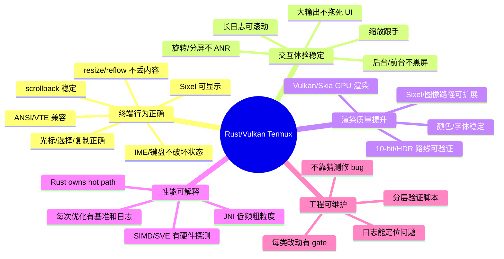
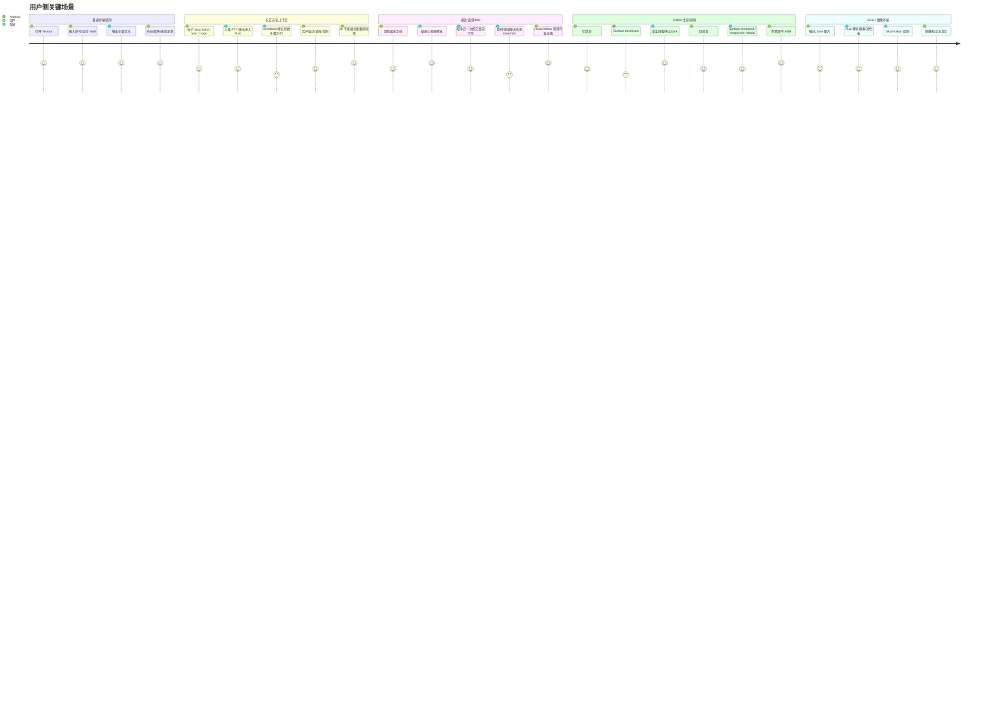
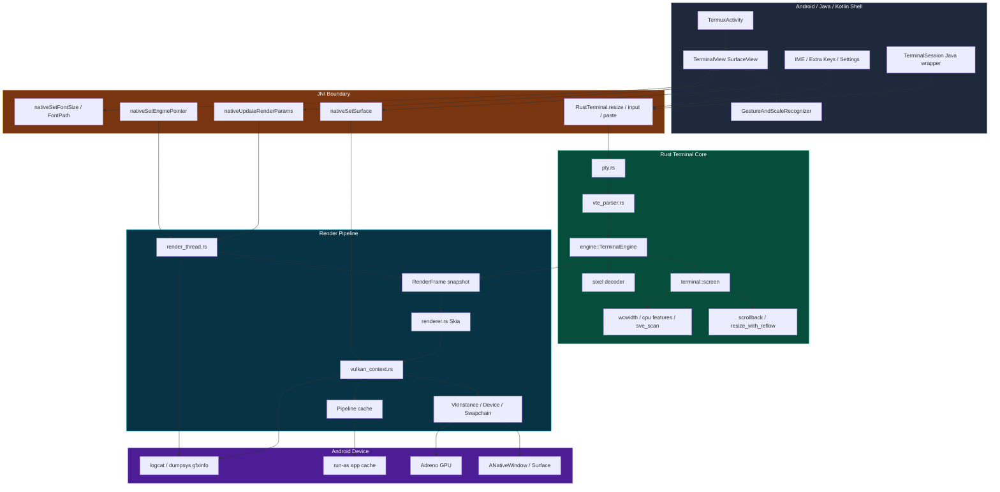
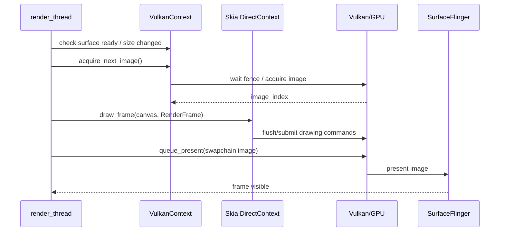
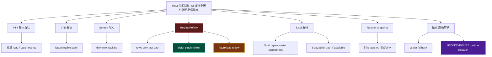
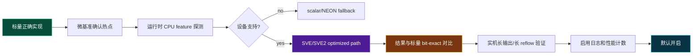
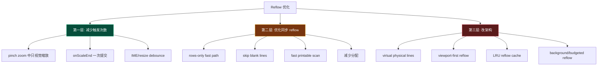
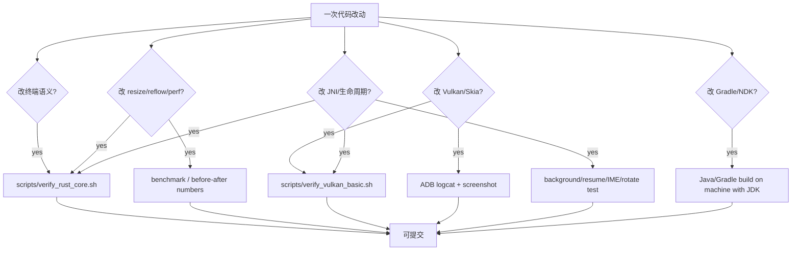

# Termux Rust/Vulkan Fork：产品图与技术图

本文档不是某个单点修复说明，而是这个 fork 的整体工作地图。

核心定位：

```text
把 Termux 的终端热路径从 Java/Canvas 迁移到 Rust + Skia + Vulkan，
目标是让 Android 上的终端在大输出、长 scrollback、Sixel、缩放/旋转/IME 生命周期变化下仍然可用、可验证、可优化。
```

---

# A. 产品图：这个项目最终要给用户什么体验

## A1. 产品目标总览



产品上不是单纯“换 Vulkan”，而是四件事同时成立：

1. 终端行为正确。
2. 长上下文下仍然顺。
3. Android 生命周期下不死锁、不黑屏。
4. 每个性能优化都能用日志/测试/实机截图验证。

---

## A2. 用户场景图



---

## A3. 产品功能分区

```mermaid
flowchart TD
    P[产品目标: Android 上高吞吐、稳定、可验证的现代终端]

    P --> B1[终端行为]
    P --> B2[渲染体验]
    P --> B3[生命周期稳定]
    P --> B4[性能路线]
    P --> B5[验证体系]

    B1 --> C11[VTE/ANSI]
    B1 --> C12[scrollback]
    B1 --> C13[selection/copy]
    B1 --> C14[resize/reflow]
    B1 --> C15[Sixel]

    B2 --> C21[Skia glyph rendering]
    B2 --> C22[Vulkan swapchain]
    B2 --> C23[颜色/字体/10-bit]
    B2 --> C24[视觉缩放]

    B3 --> C31[Surface create/destroy]
    B3 --> C32[后台/前台]
    B3 --> C33[IME 弹出/收起]
    B3 --> C34[分屏/旋转]

    B4 --> C41[Rust hot path]
    B4 --> C42[JNI 降频]
    B4 --> C43[dirty rows/snapshots]
    B4 --> C44[SVE/SIMD]

    B5 --> C51[Rust core tests]
    B5 --> C52[Vulkan logcat]
    B5 --> C53[ADB 实机脚本]
    B5 --> C54[性能计数/截图]

    style P fill:#0f172a,stroke:#22d3ee,color:#fff
    style B1 fill:#064e3b,stroke:#34d399,color:#fff
    style B2 fill:#083344,stroke:#22d3ee,color:#fff
    style B3 fill:#78350f,stroke:#fbbf24,color:#fff
    style B4 fill:#4c1d95,stroke:#a78bfa,color:#fff
    style B5 fill:#881337,stroke:#fb7185,color:#fff
```



---

# B. 技术图：当前架构怎么分层

## B1. 总架构图



关键边界：

| 层 | 应该负责 | 不应该负责 |
|---|---|---|
| Java/Kotlin | Activity、IME、Surface、设置、手势、粗粒度 JNI | 终端状态真相、逐 cell 绘制、全量 reflow |
| JNI | 低频生命周期/输入/参数同步 | 高频 per-byte/per-cell 回调 |
| Rust Core | PTY、VTE、screen、scrollback、resize/reflow、Sixel | Android UI 控件 |
| Render Thread | 帧调度、snapshot、Skia 绘制 | 修改 terminal 语义状态 |
| VulkanContext | Instance/Device/Swapchain/Skia backend/GPU sync | 业务逻辑 |

---

## B2. 终端行为技术图

```mermaid
flowchart LR
    Input[PTY bytes / keyboard / paste] --> Parser[VTE parser]
    Parser --> Engine[TerminalEngine state machine]

    Engine --> Screen[Screen grid]
    Engine --> Cursor[Cursor / modes]
    Engine --> Style[SGR colors/styles]
    Engine --> Sixel[Sixel decoder]

    Screen --> Scrollback[Ring buffer scrollback]
    Screen --> Resize[resize_rows_only / resize_with_reflow]
    Screen --> Selection[Selection / selected text]

    Resize --> Fast{columns unchanged?}
    Fast -- yes --> RowsOnly[O(1)/near O(rows) rows-only path]
    Fast -- no --> Reflow[O(active transcript × columns) full reflow]

    Engine --> Snapshot[RenderFrame snapshot]
    Sixel --> Snapshot
    Snapshot --> Renderer[Skia renderer]

    style Reflow fill:#5b1b1b,stroke:#fb7185,color:#fff
    style RowsOnly fill:#064e3b,stroke:#34d399,color:#fff
    style Snapshot fill:#083344,stroke:#22d3ee,color:#fff
```

终端行为的产品验收应该按这些维度拆：

1. Parser correctness：ANSI/CSI/OSC/DECSET/SGR。
2. Screen correctness：光标、换行、宽字符、组合字符、样式继承。
3. Scrollback correctness：历史行增长、清除、滚动、选择。
4. Resize/reflow correctness：列数变动、行数变动、光标位置、line_wrap。
5. Sixel correctness：raster、repeat、palette、尺寸、文本共存。

---

# C. Vulkan：怎么验证，怎么优化

## C1. Vulkan 生命周期图

```mermaid
stateDiagram-v2
    [*] --> NoSurface

    NoSurface --> SurfaceCreated: TerminalView.surfaceCreated
    SurfaceCreated --> VulkanInit: nativeSetSurface(surface)
    VulkanInit --> Rendering: VulkanContext::new or update_surface success

    Rendering --> ResizeSwapchain: surfaceChanged/onSizeChanged
    ResizeSwapchain --> Rendering: recreate_swapchain success

    Rendering --> SurfaceLost: surfaceDestroyed or ERROR_SURFACE_LOST
    SurfaceLost --> RenderThreadStopped: nativeSetSurface(null)
    RenderThreadStopped --> NoSurface: surface unavailable

    NoSurface --> SurfaceCreated: Activity resume / Surface recreated

    note right of Rendering
      acquire image
      draw Skia
      flush/submit
      present
    end note

    note right of SurfaceLost
      不允许 UI 线程无限等待
      不允许 Drop 顺序崩溃
      不允许旧线程写新 surface
    end note
```

---

## C2. Vulkan 渲染帧图



当前已经验证过的关键事实：

- 设备：Android 16 / API 36，Adreno 840。
- `VulkanContext::new()` 冷启动约 5-6ms。
- pipeline cache 存在于 app 私有 cache：`cache/vulkan_pipeline_cache.bin`。
- pipeline cache 对 Vulkan bootstrap 初始化没有可测加速；它更像是 shader/pipeline 编译卡顿的保险。
- `Perf: SLOW FRAME total≈500ms` 曾被识别为空闲 park 计时污染，不等于 GPU 慢帧。

---

## C3. Vulkan 验证矩阵

| 目标 | 看什么 | 命令/方法 | 通过标准 |
|---|---|---|---|
| Vulkan 能启动 | logcat | `VulkanContext::new: SUCCESS` | 无 crash / no black screen |
| GPU/格式协商 | logcat | physical device / swapchain format | Adreno 840，格式稳定 |
| Surface 生命周期 | logcat | surfaceCreated/Changed/Destroyed/nativeSetSurface | 切后台/回前台不 ANR |
| Swapchain resize | logcat | nativeOnSizeChanged/recreate_swapchain | IME/旋转后画面恢复 |
| Pipeline cache | run-as + stat/hash | `run-as com.termux stat cache/vulkan_pipeline_cache.bin` | 文件存在、header 合法、可 load/save |
| 绘制正确性 | 截图/vision/manual | `seq 1 300`、颜色输出、sixel | 文本无错乱、无黑屏 |
| 慢帧真实性 | 分段 timing | acquire/draw/flush/present/idle 分开 | 慢在 draw/present 才算问题 |
| 后台 CPU | dumpsys/top | 切后台观察线程 | render thread 停止/park |

---

## C4. Vulkan 优化路线

```mermaid
flowchart TD
    V0[Vulkan 优化目标]

    V0 --> V1[正确性优先]
    V1 --> V11[Surface generation id]
    V1 --> V12[bounded lock / no UI ANR]
    V1 --> V13[semaphore/fence sync]
    V1 --> V14[Drop order / Skia abandon]

    V0 --> V2[启动与恢复]
    V2 --> V21[复用 Instance/Device]
    V2 --> V22[只重建 Surface/Swapchain]
    V2 --> V23[去掉 800ms 强制重挂载 workaround]

    V0 --> V3[帧性能]
    V3 --> V31[dirty rows / dirty rect]
    V3 --> V32[glyph atlas / style batching]
    V3 --> V33[draw timing 分段]
    V3 --> V34[避免空闲慢帧误报]

    V0 --> V4[Pipeline cache]
    V4 --> V41[验证 load/save/header]
    V4 --> V42[去重重复保存]
    V4 --> V43[dirty/hash guard]
    V4 --> V44[不要宣称加速 bootstrap]

    style V1 fill:#064e3b,stroke:#34d399,color:#fff
    style V2 fill:#78350f,stroke:#fbbf24,color:#fff
    style V3 fill:#083344,stroke:#22d3ee,color:#fff
    style V4 fill:#4c1d95,stroke:#a78bfa,color:#fff
```



优先级判断：

1. 先修生命周期 correctness，不要再靠 SurfaceView 800ms 强制重挂载。
2. 再修日志/计时，让慢帧日志可信。
3. 再优化 dirty rendering / glyph batching。
4. pipeline cache 只作为 shader/pipeline 卡顿保险，不作为启动优化主线。

---

# D. Rust 性能与 SVE/SIMD 实现路线

## D1. Rust 性能热点地图



当前已经存在的相关文件：

| 文件 | 当前作用 |
|---|---|
| `terminal::screen::resize_with_reflow` | cols 变化时全量重排 scrollback，主要性能风险点 |
| `terminal::screen::resize_rows_only` | columns 不变时快路径 |
| `sve_scan.rs` | aarch64 下探测 SVE，尝试 fast printable scan |
| `cpu_features.rs` | runtime 探测 SVE2 |
| `simd/mod.rs` | RGBA8 → RGBA10 动态分派框架，目前 SVE2 路径被注释 |
| `terminal/sixel.rs` | Sixel 解码，并有 SVE2 图像数据路径探测 |
| `docs/design/sve_reflow_optimization.md` | SVE + incremental reflow 的设计草案 |

---

## D2. SVE/SIMD 产品化路线



SVE/SVE2 不应该直接“为了酷”写进主路径。必须满足：

1. 标量版本先是权威实现。
2. SVE/SVE2 只作为可替换 fast path。
3. 运行时 feature detection，不能假设所有 arm64 都支持。
4. 每个 fast path 都要和标量结果 bit-exact 对比。
5. 没有性能数据不合入默认路径。

---

## D3. Reflow 性能路线

当前 reflow 的真实问题：

```text
列数变化时，为了保持 scrollback 语义正确，需要把历史行重新折行。
长 scrollback 下，这件事天然很贵。
```

所以路线应该分三层：



当前 `f34e3bc2` 属于第一层：减少触发次数。

`docs/design/sve_reflow_optimization.md` 属于第三层：virtual buffer + incremental/lazy reflow。

---

# E. 项目级验证图

## E1. 改动类型到验证 gate



---

## E2. 实机验证脚本/日志建议

### 终端行为

```bash
adb -s <device> shell input text 'seq%s1%s300'
adb -s <device> shell input keyevent ENTER
adb -s <device> exec-out screencap -p > /tmp/termux.png
```

看：

- 文本是否连续。
- 颜色/光标是否错乱。
- scrollback 是否可滚。
- selection 是否仍然对应字符格。

### Resize/Reflow

```bash
logcat | grep -E 'RustTerminal.resize|resize_with_reflow|Pinch zoom commit|nativeSetFontSize'
```

看：

- pinch 中不反复 `nativeSetFontSize`。
- 松手后最多一次 commit。
- rows-only 场景不进入 full reflow。

### Vulkan

```bash
logcat | grep -E 'VulkanContext::new|surfaceCreated|surfaceChanged|surfaceDestroyed|recreate_swapchain|Pipeline cache|SLOW FRAME|draw_frame slow'
```

看：

- 冷启动 Vulkan 成功。
- Surface destroy/create 不 ANR。
- swapchain resize 后恢复。
- slow frame 是否是真 draw/present 慢，而不是 idle 误报。

### Pipeline cache

```bash
adb -s <device> shell run-as com.termux stat cache/vulkan_pipeline_cache.bin
adb -s <device> shell run-as com.termux sha256sum cache/vulkan_pipeline_cache.bin
adb -s <device> shell run-as com.termux od -An -tx4 -N32 cache/vulkan_pipeline_cache.bin
```

看：

- 文件存在。
- header vendor/device 合法。
- load/save 日志存在。
- 不把它当作 Vulkan bootstrap 加速证据。

### SVE/SIMD

```bash
adb -s <device> shell cat /proc/cpuinfo | grep -i Features
```

看：

- 是否含 `sve` / `sve2`。
- 如果没有，fast path 必须 fallback。
- 如果有，才允许打开 SVE/SVE2 性能路径。

---

# F. 建议的路线图

## F1. 当前阶段：稳定性与可验证性

优先做：

1. 修 `render_thread.rs` idle 慢帧统计。
2. 给 Surface/native render thread 加 generation id。
3. 移除或替换 Java 侧 800ms Surface 强制重挂载 workaround。
4. 去重 pipeline cache 双重保存。
5. 把 pinch zoom reflow 优化安装实测。

不优先做：

- 直接上复杂 lazy reflow。
- 直接宣称 pipeline cache 会加速 Vulkan 初始化。
- 在没有 bit-exact 测试前默认启用 SVE/SVE2 主路径。

## F2. 下一阶段：性能架构

1. 建 reflow benchmark：10k/50k/100k 行，不同列宽变化。
2. 给 `resize_with_reflow` 加分段 timing：blank skip、char scan、row write、allocation。
3. 确定 SVE/SVE2 真实热点：
   - printable byte scan？
   - wcwidth？
   - Sixel pixel conversion？
   - RGBA8 → RGBA10？
4. 先做 scalar baseline + benchmark。
5. 再接 NEON/SVE/SVE2 runtime dispatch。

## F3. 第三阶段：产品级能力

1. 长 scrollback 下缩放/旋转不明显卡顿。
2. Sixel 图片显示稳定。
3. 大输出时 UI thread 不被拖死。
4. Vulkan 生命周期切后台/回前台稳定。
5. 每个优化都能用日志和实机命令复现。

## F4. 未来规划：UI 组合层与 Vulkan 边界

当前结论：不要把 Android UI 控件整体纳入 Vulkan 绘制范围。Vulkan/Skia 的范围应是终端内容平面：文本、光标、selection、Sixel/图像终端、scrollback 可视区域、后续可能的终端内 overlay。抽屉栏、按钮、toolbar、设置 UI、IME、Material 控件仍应由 Android View 系统负责。

原因：

1. 把 drawer/button/toolbar 改成 Vulkan 绘制不会自动解决点击问题；点击仍要回到 Android input、focus、accessibility、IME、手势分发。
2. Android View 控件自带无障碍、状态、ripple、键盘焦点、主题和生命周期；用 Vulkan 重写会显著扩大维护面。
3. 终端热路径的性能瓶颈在 PTY/VTE/screen/render snapshot/glyph 绘制，不在左侧抽屉按钮这类低频 UI。
4. 当前左侧边框/抽屉按钮失效更像是 SurfaceView 与 DrawerLayout 的层级/重挂载顺序问题，而不是“按钮也需要 Vulkan 绘制”的问题。

必须纳入 Vulkan 规划的是“组合边界”而不是“所有 UI 绘制”：

- SurfaceView/TextureView 与 DrawerLayout、toolbar、PopupWindow、selection handle 的 z-order 必须可验证。
- Surface 重建 workaround 不能改变 XML 中的 child order；TerminalView 应保持在 drawer 内容之下。
- 任何 removeView/addView 强制重挂载都要恢复原 index，避免 SurfaceView append 到最后覆盖抽屉和按钮点击。
- 实机验证要包含：打开 drawer、点击键盘按钮、新建 session 按钮、extra keys、selection toolbar、IME 弹出/收起。

后续如果需要统一视觉风格，可以先做“Vulkan 终端内 overlay”，例如终端内 FPS/性能 HUD、selection 高亮、鼠标/光标效果；不要先把 Android 控件迁入 Vulkan。

## F5. 未来规划：Shizuku / shell 权限观测接口

定位：这是未来的系统观测能力规划，不是当前必须实现的执行设计，也不应该成为普通 Termux session 的默认执行路径。

高 Android 版本上，普通 app uid 对系统级 CPU 时间、进程状态、内存、logcat、dumpsys、perfetto 等信息的访问越来越受限。后续可以考虑接入 Shizuku/rish，作为一个可选的 shell uid 2000 观测后端，用于补齐系统性能诊断能力。

边界原则：

1. 默认 Termux 执行路径仍然是 app uid + Rust PTY + `$PREFIX` ecosystem。
2. Shizuku 不用于替代普通 `bash/pkg/python` session，也不用于掩盖 app uid 执行链回归。
3. Shizuku 后端优先运行干净 Android shell 环境下的系统命令：`/system/bin/top`、`ps`、`dumpsys cpuinfo`、`dumpsys meminfo`、`logcat`、`cmd`、`perfetto` 等。
4. 默认不把 Termux 的 `LD_PRELOAD`、`PREFIX`、`PATH=$PREFIX/bin` 注入 shell uid 命令，避免污染系统命令和制造 linker/owner 问题。
5. Shizuku 输出应通过 stdout/Binder/pipe 回到 app，由 app uid 保存报告；避免 shell uid 直接写 `$HOME`/`$PREFIX`。
6. UI/日志上必须明确区分普通 app shell、Shizuku shell、root shell，不能静默升级权限。

规划价值：

- 采集全系统 CPU/线程占用、调度压力和后台 CPU 状态。
- 获取 `dumpsys meminfo`、系统内存压力、LMKD/oom 相关信息。
- 读取 logcat、dumpsys、cmd service 状态，辅助诊断 Termux/Vulkan/渲染生命周期问题。
- 为未来性能面板提供系统侧数据：Termux 自身指标由 app 内 Rust/Java 采集，系统指标由 Shizuku backend 补齐。

非目标：

- 不是当前 W^X、PTY、`libtermux-exec`、`su` 兼容问题的必要修复路径。
- 不是高 Android 版本的默认命令执行后端。
- 不是 root 替代品；shell uid 仍受 SELinux 和 Android 权限边界限制。

---

# G. 一句话总图

```text
产品上：这是一个“长上下文、高输出、图形能力、生命周期稳定”的 Android 终端。
技术上：Java/Kotlin 只做 Android shell，Rust 持有终端真相，Skia/Vulkan 负责高吞吐绘制，SVE/SIMD 只作为经过验证的 fast path。
```
